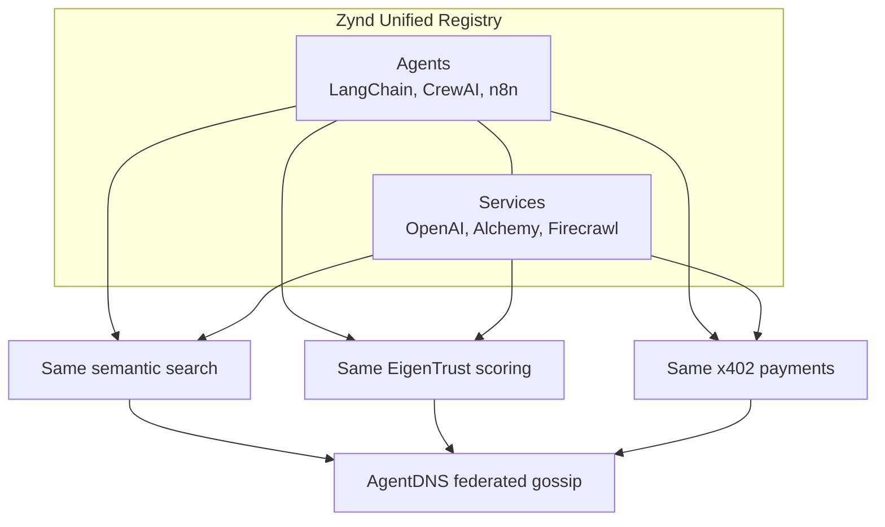

# Zynd Services Directory

> Add a directory of external API services (OpenAI, Alchemy, Firecrawl, etc.) that agents can discover and pay for — same registry, same search, same trust layer.

## Why Now

- **MPP** (Stripe/Tempo) launched March 2026 with 100+ services, 1,400 agents, $12K/week volume
- **MCP** has 20K+ servers but **zero native payment layer** — biggest gap in the market
- **Nobody** combines agent registry + service directory + payments + trust + federated discovery

## Competitive Landscape

| Player | Services | Payments | Trust | Federated | Agent Comms |
|--------|----------|----------|-------|-----------|-------------|
| **ZyndAI** | No (gap) | x402 | EigenTrust | Yes (AgentDNS) | Yes |
| **MPP** (Stripe) | 100+ | Multi-rail | None | No | No |
| **x402** (Coinbase) | No | USDC on Base | None | No | No |
| **A2A** (Google) | No | None (AP2 separate) | None | No | Yes |
| **Fetch.ai** | Agents only | FET token | Platform-locked | No | Yes |
| **Nevermined** | Some | Credits/x402 | Platform-locked | No | No |

## What MPP Does (And Doesn't)

**Does:** Curated list of API proxies with payment wrappers. OpenAI, Anthropic, Alchemy, Exa, Google Maps, etc. Stripe fiat + stablecoins. IETF spec submitted.

**Doesn't:** No trust/reputation. No federated discovery. No agent-to-agent. No composability. Fiat US-only. Sessions tied to Tempo chain.

## Recommendation

Treat **services as first-class entities alongside agents** in the existing registry.

| | MPP | Zynd Services |
|---|-----|---------------|
| **Discovery** | Centralized table | Federated semantic search + bloom filters |
| **Trust** | None | EigenTrust from actual usage |
| **Composability** | Service only | Agent → Service → Agent → Service |
| **Identity** | URL-based | DID-based (verifiable, portable) |
| **Payment** | Tempo chain only | x402 + MPP-compatible + ZyndPay |
| **Onboarding** | Proxy setup required | `zynd service register` wraps any OpenAPI spec |

## Architecture

Services and agents share the same registry, search, payments, and trust system. A `entity_type` field distinguishes them (`"agent"` vs `"service"`). AgentDNS gossips both across the mesh.



## Revenue Model

| Transaction | Service Price | Zynd Commission (10%) | Agent Pays |
|-------------|-------------|----------------------|------------|
| Agent → Service | $0.01 | $0.001 | $0.011 |
| Agent → Agent | $0.05 | $0.005 | $0.055 |

Commission configurable. Self-hosted registries can set to 0%.

## Priority Services to List

| Category | Services | Why |
|----------|----------|-----|
| AI/LLM | OpenAI, Anthropic, Groq, DeepSeek | Every agent needs inference |
| Search | Exa, Brave Search, Firecrawl | Agents need web access |
| Blockchain | Alchemy, Dune, CoinGecko | Our Web3 DNA |
| Data | Google Maps, Alpha Vantage, Hunter | High-volume on MPP |
| Compute | Modal, Judge0 | Agents running code |

Start with 20-30 high-quality services. Quality over quantity.

## Killer Differentiator: Composable Workflows

MPP: agents call services one at a time. ZyndAI: agents **chain services and other agents** in a single workflow.

```python
results = await agent.compose([
    ("service", "exa-search", {"query": "latest AI research"}),
    ("service", "firecrawl", {"urls": "$prev.urls"}),
    ("agent", "research-summarizer", {"docs": "$prev.content"}),
])
```

MPP can't do this (no agent layer). A2A can't do this (no service layer). Only ZyndAI has both.

## Implementation Phases

| Phase | Scope | Timeline |
|-------|-------|----------|
| 1. Schema + Registry | Add `entity_type` to registry, service fields, search filter | 1-2 weeks |
| 2. SDK + CLI | `zynd service register/search`, `agent.search_services()` | 1 week |
| 3. Service Directory UI | `/services` page with search, categories, pricing | 1-2 weeks |
| 4. Proxy + Payments | Wrap non-x402 services, route through ZyndPay | 1-2 weeks |
| 5. Health + Trust | Health checks, latency tracking, EigenTrust scoring | Ongoing |

## Market Context (April 2026)

- 179 projects in agent payments space, $43M settled volume (~$600M annualized)
- 98.6% of settlements in USDC
- x402 Foundation: Coinbase + Google + AWS + Visa + Mastercard (April 2)
- MPP: Stripe + Paradigm backing, $500M Series A at $5B valuation

## Sources

[MPP](https://mpp.dev/) | [x402](https://www.x402.org/) | [A2A](https://a2a-protocol.org/) | [MCP](https://modelcontextprotocol.io/) | [Fetch.ai](https://agentverse.ai/) | [Nevermined](https://nevermined.ai/) | [Olas](https://olas.network/) | [Virtuals](https://www.virtuals.io/) | [Skyfire](https://skyfire.xyz/) | [Agent Payments Stack](https://agentpaymentsstack.com/) | [MPPScan](https://mppscan.com/)
